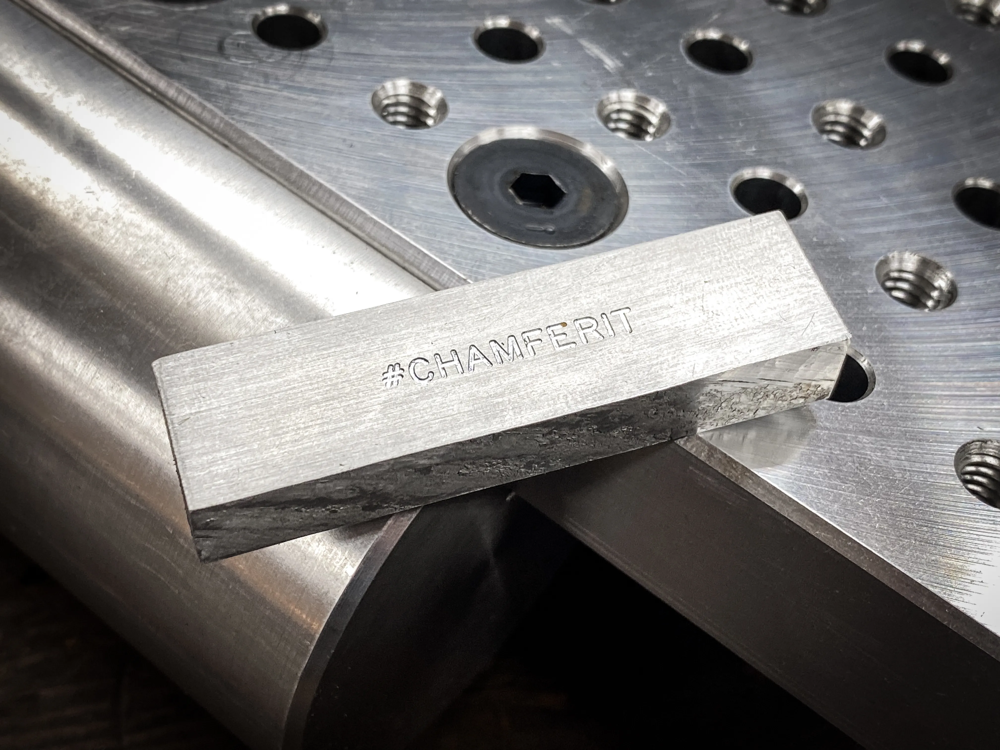
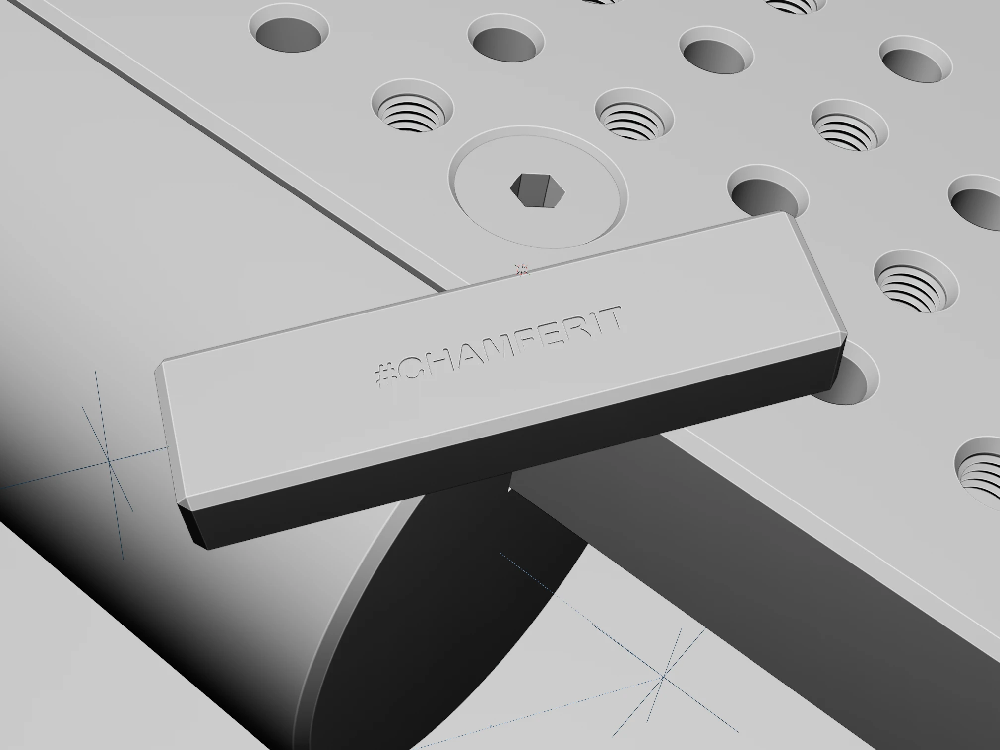

+++
title = "Chamfered Block"
description = """Recreation of Inheritance Machining's #chamferit block in Blender, with chamfers added :)

Lighting and material practice

Reference Photo Credit: [InheritanceMachining](https://www.youtube.com/@InheritanceMachining)
"""
date = 2024-06-02
[taxonomies]
tags = ["Blender"]
[extra]
thumbnail = "grbt_chamf29.webp"
+++

{{  }}
{{  }}
{{  }}
