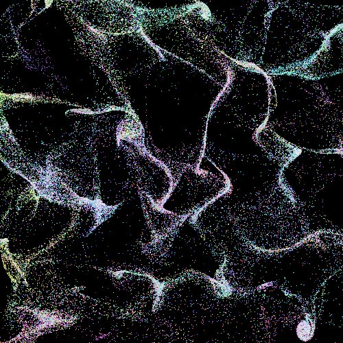
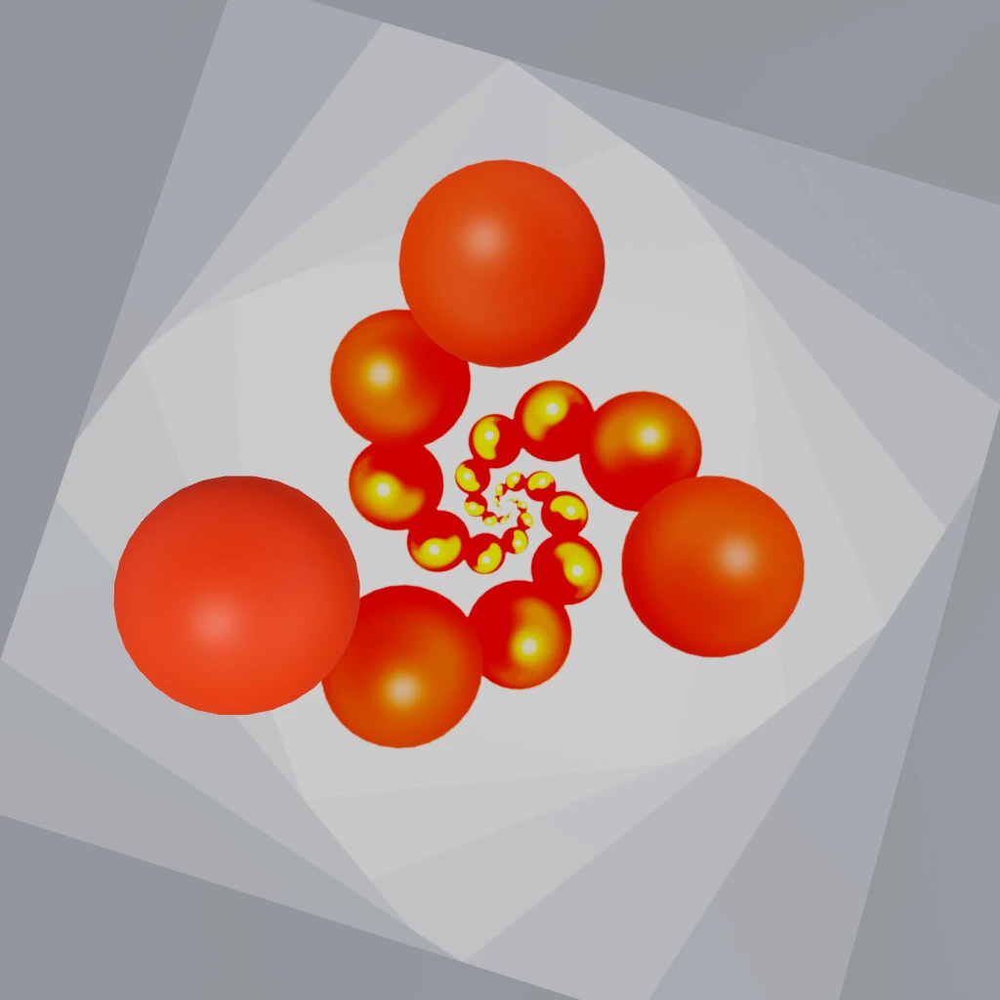
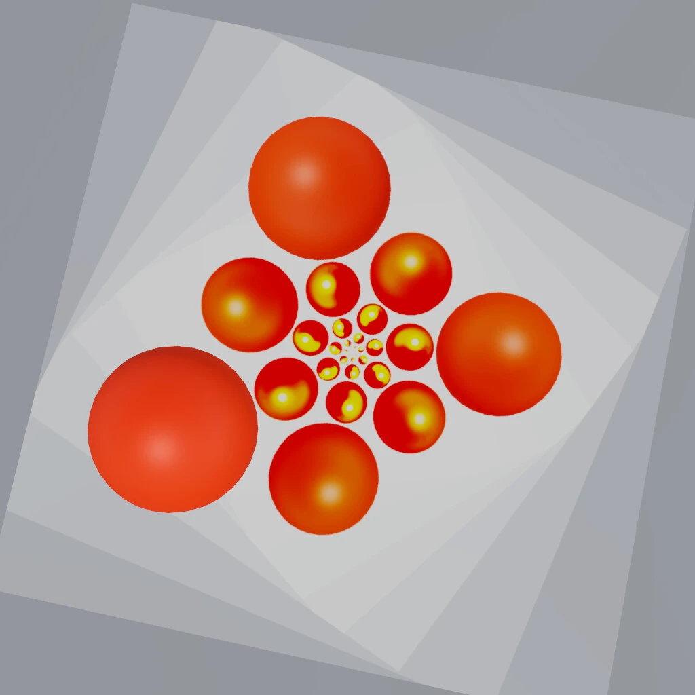
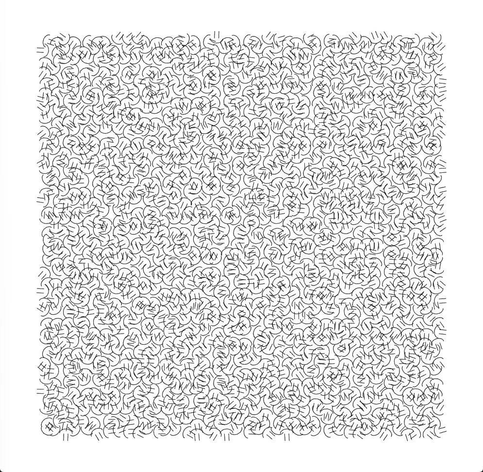
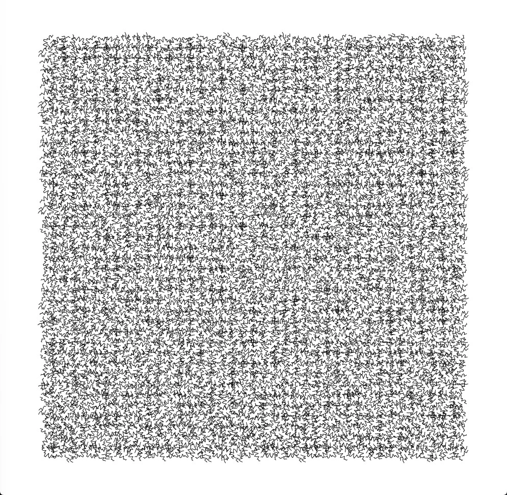
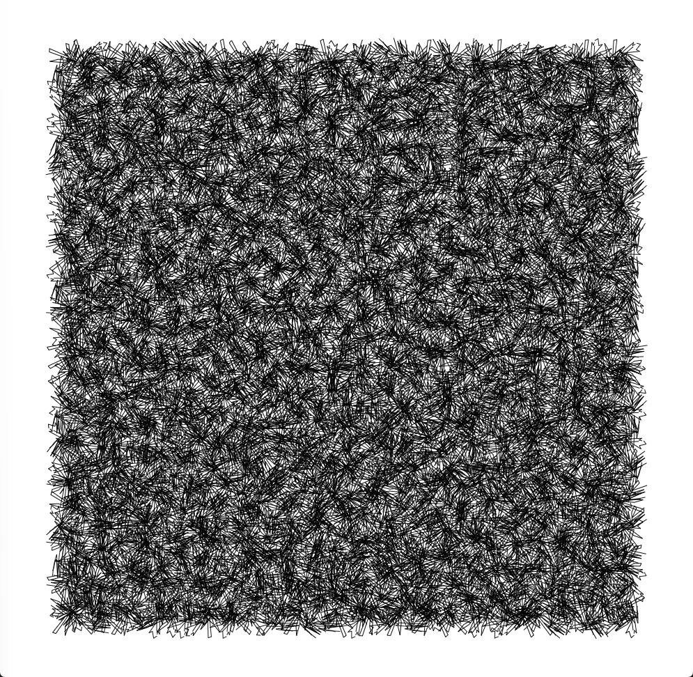

+++
title = "Genuary 2024"
description = "[https://genuary.art](https://genuary.art) for 2024 using [vvvv](https://visualprogramming.net)"
date = 2024-01-31
[taxonomies]
tags = ["vvvv"]
[extra]
thumbnail = "grbt_thumb.webp"
+++

{{  }}

{{ <video src="grbt_3_droste.mp4"/> }}

{{  }}

{{  }}

{{ <video src="grbt_4_pixels.mp4" text="Day 4 (Pixels)"/> }}

{{  }}

{{  }}

{{  }}

{{ <video src="grbt_6_screensaver.mp4" text="Day 6 (Screensaver)"/> }}