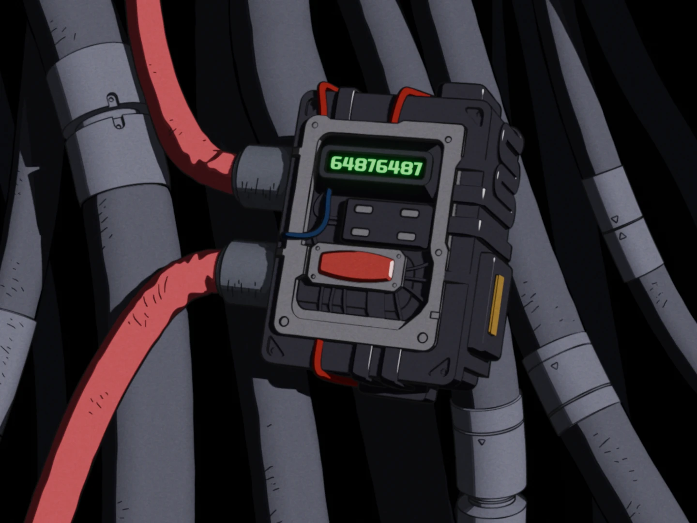
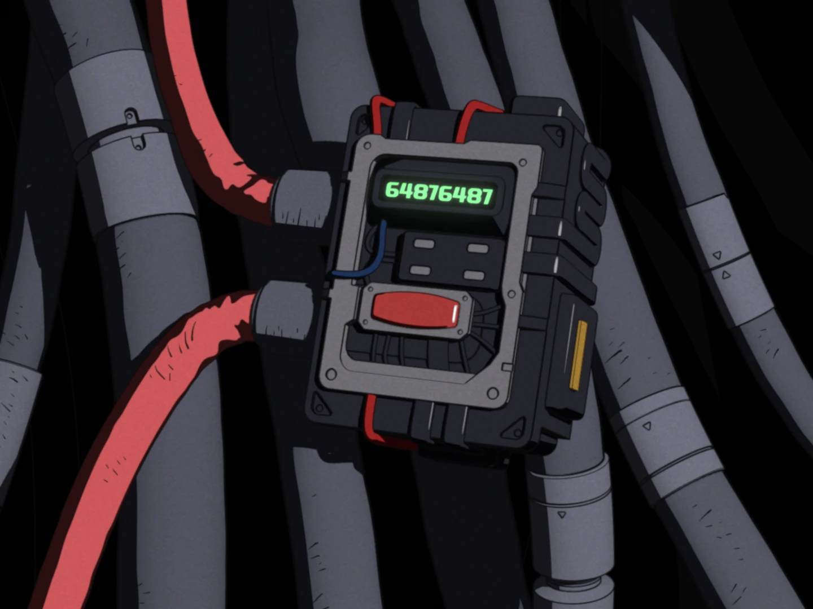
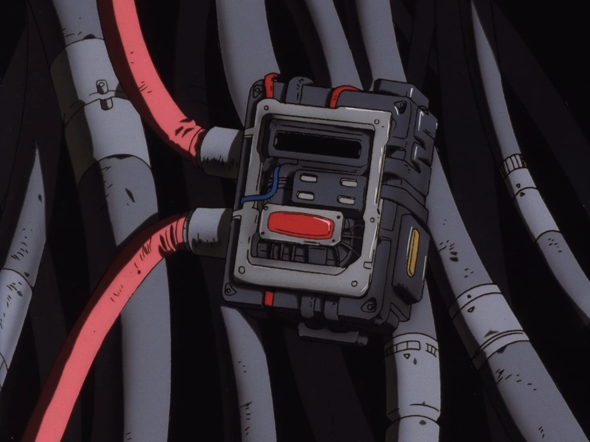
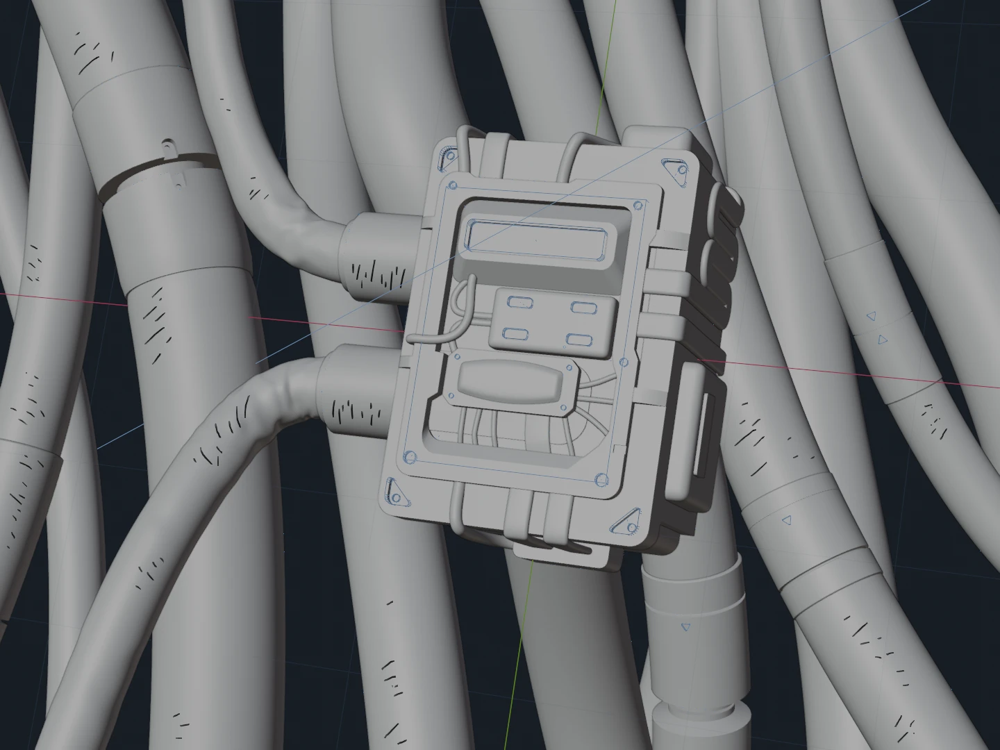

+++
title = "Hacking Device"
description = """Hacking device from Cowboy Bebop recreated in Blender and rendered with [Malt](https://github.com/bnpr/Malt) and EEVEE (Blender 4.5)"""
date = 2025-04-20
[taxonomies]
tags = ["Blender"]
[extra]
thumbnail = "grbt_device35.webp"
+++

{{ <video src="grbt_hacking-device.mp4" autoplay={true}/> }}

{{  }}
{{  }}
{{  }}
{{  }}
