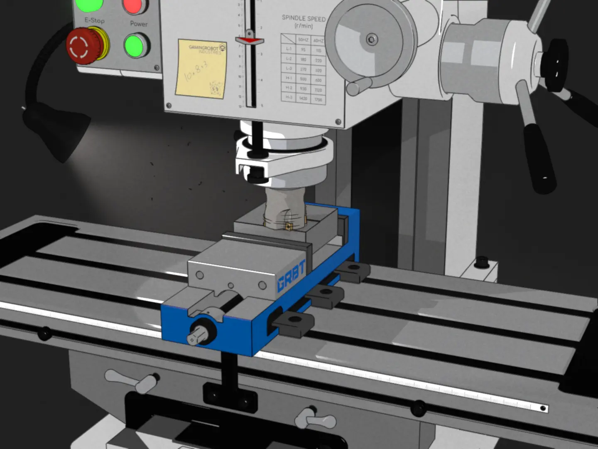
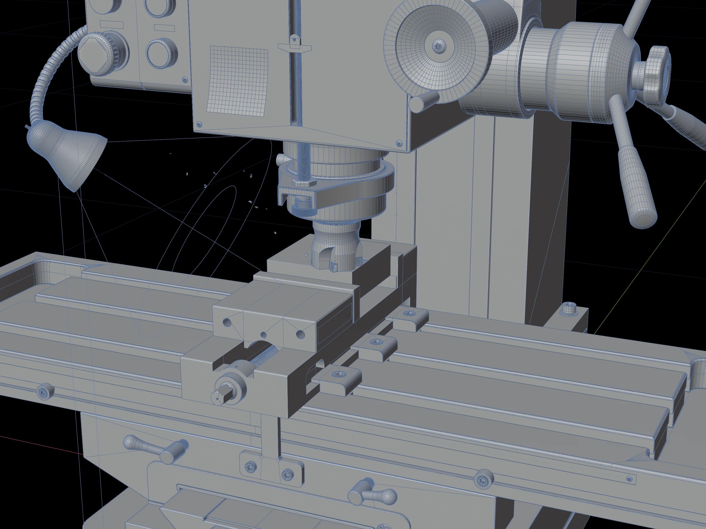

+++
title = "Milling Machine"
description = """Milling machine rendered with EEVEE and line art rendered with Malt/Cider  
[Breakdown](https://doingstuff.dev/posts/blender-milling-machine-breakdown)"""
date = 2025-10-12
[taxonomies]
tags = ["Blender"]
[extra]
thumbnail = "grbt_mill.webp"
+++

{{ <video src="grbt_mill.mp4" autoplay={true}/> }}

{{  }}
{{  }}
